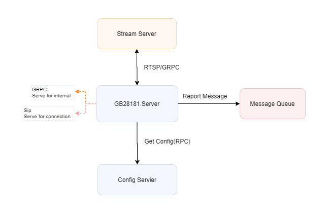

# GB28181 Standard

+ GB28181开源的目标是：通过代码复用，适当降低工作难度和减少业务代码的重复性，并非替代你的开发工作或者让你几乎不用开发工作。
+ 最新国标是：【[GB28181-2016](docs/GBT%2028181-2016%20公共安全视频监控联网系统信息传输、交换、控制技术要求-目录版.pdf)】
+ 项目非常年轻，诚邀请大家能一起完善，希望每一个对本项目感兴趣的朋友，都能成为本项目的共同作者或者贡献者
+ 注意：**代码一直在更新，GB28181系列项目，并不是生产就绪的，往往须要根据自己的项目和产品架构，做适当的调整和适配！！**
+ 仓库体积较大，为加快clone速度，建议使用：`git clone https://github.com/GB28181/GB28181.Solution.git --depth=1`

## 运行环境(environment)

~~~ bash
running in docker
running on Linux
running on aspnetcore 3.1+
~~~

+ [GB28181.Solution的模块说明](./SolutionModules.md)
+ [可以协同测试的Linux/Windows版工具](https://github.com/GB28181/GB28181-Simulation-Tool)
+ [Wiki](https://github.com/GB28181/GB28181.Solution/wiki) 和 [相关资源](https://gb28181.github.io/Awesome)
+ [FAQ:常见的一些问题](https://github.com/GB28181/GB28181.Solution/wiki/FAQ:%E5%B8%B8%E8%A7%81%E7%9A%84%E4%B8%80%E4%BA%9B%E9%97%AE%E9%A2%98)
+ [WinTool视频播放测试指南](https://github.com/GB28181/GB28181.Solution/wiki/WinTool%E8%A7%86%E9%A2%91%E6%92%AD%E6%94%BE%E6%B5%8B%E8%AF%95%E6%8C%87%E5%8D%97)
+ [使用WinTool推流到SRS并通过VLC观看](https://github.com/GB28181/GB28181.Solution/wiki/%E4%BD%BF%E7%94%A8WinTool%E6%8E%A8%E6%B5%81%E5%88%B0SRS%E5%B9%B6%E9%80%9A%E8%BF%87VLC%E8%A7%82%E7%9C%8B)
## 说明(instruction)

+ Mainly on `develop` branch ,in order to support .net core3.1+.
  + develop分支为主分支(默认分支).
+ The windows function part was not maintained .
  + Form Client Project Need to be fixed.
+ you can refer to other branch in this repo , `PRs` are always welcome.
+ provide grpc interface for other microservice

## 一些要做的事情(TODO List)

项目希望达到的目标功能,看这里：[项目的技术需求和TODO列表](https://github.com/GB28181/GB28181.Solution/wiki/%E9%A1%B9%E7%9B%AE%E9%9C%80%E6%B1%82%E5%92%8CTODO%E5%88%97%E8%A1%A8)

## 模块在系统内架构关系

下图展示 GB28181.Server 在整个系统架构中设定的、与其他服务的模块关系以及交互方式设计：

 

*需要注意：图示中的架构设计，不一定适合你的项目需求和你的系统架构设计要求，往往需要根据你的项目实际做修改和调整*

*欢迎共同讨论，共同进步，欢迎PR*

## 讨论、成为共同作者、近距离贡献

微信扫描二维码，添加好友，进入微信讨论群(注明：GB28181-公司-姓名)：

## Inspired By

+ [Gb28181_Platform](https://github.com/mackenbaron/Gb28181_Platform)

+ [sipsorcery](https://github.com/sipsorcery/sipsorcery)

+ [GB28181-2016(C/C++)](https://github.com/unitycs/GB28181Platform)

## License

MIT & BSD v3 and later

***注意：项目中用到的 [SIPSorcery](https://github.com/sipsorcery/sipsorcery)类库中的部分代码，明确使用了[GPL License](http://www.opensource.org/licenses/gpl-license.php)，详情请检索代码文件。

关于GPL的更多了解：[开源中国GPL](https://www.oschina.net/question/12_2826)、[百科 GPL](https://baike.baidu.com/item/GPL/2357903)

## 其他

+ [GB28181.Solution的模块说明](./SolutionModules.md)
+ [可以协同测试的Linux/Windows版工具](https://github.com/GB28181/GB28181-Simulation-Tool)
+ [wiki](https://github.com/GB28181/GB28181.Solution/wiki)
+ [FAQ:常见的一些问题](https://github.com/GB28181/GB28181.Solution/wiki/FAQ:%E5%B8%B8%E8%A7%81%E7%9A%84%E4%B8%80%E4%BA%9B%E9%97%AE%E9%A2%98)
+ [WinTool视频播放测试指南](https://github.com/GB28181/GB28181.Solution/wiki/WinTool%E8%A7%86%E9%A2%91%E6%92%AD%E6%94%BE%E6%B5%8B%E8%AF%95%E6%8C%87%E5%8D%97)
+ [使用WinTool推流到SRS并通过VLC观看](https://github.com/GB28181/GB28181.Solution/wiki/%E4%BD%BF%E7%94%A8WinTool%E6%8E%A8%E6%B5%81%E5%88%B0SRS%E5%B9%B6%E9%80%9A%E8%BF%87VLC%E8%A7%82%E7%9C%8B)
